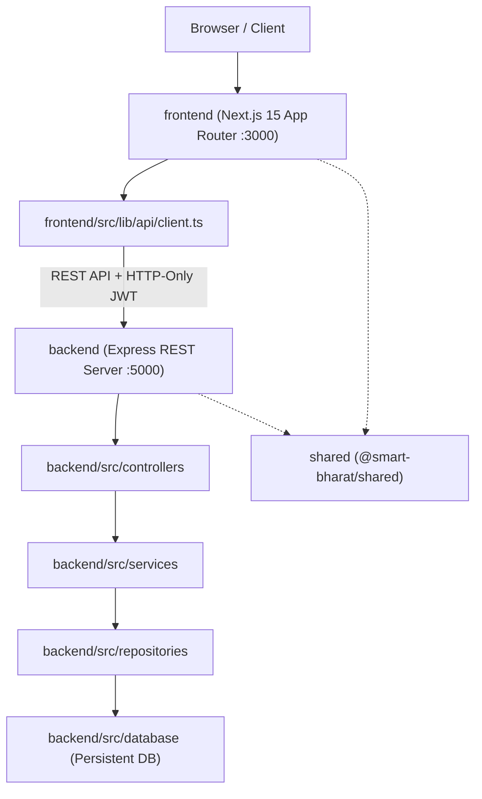

# Smart Bharat AI System Architecture

## Overview
Smart Bharat AI is structured as a production-ready TypeScript Monorepo featuring decoupled frontend, backend, and shared domain validation layers.

## Monorepo Layers
- **frontend/**: Next.js 15 App Router user interface for citizen portal, identity verification, AI scheme recommendations, complaints, and digital credential vault.
- **backend/**: Express.js REST API implementing Controller-Service-Repository architecture with JWT authentication, OTP verification, and user management.
- **shared/**: `@smart-bharat/shared` TypeScript package providing shared domain types, DTOs, and client/server password validation logic.
- **data/**: Curated dataset and JSON schemas for government schemes, ID rules, and AI assistant prompts.
- **e2e/**: End-to-end testing suite validating citizen workflows.
